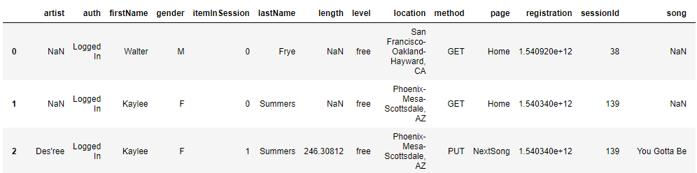

# Data-Modeling-with-Apache-Cassandra

## Table of Contents
1. [Description](#Description)
    1. [Introduction](#Introduction)
    2. [Raw Data](#RawData)
2. [Getting Started](#gettingstarted)
    1. [File Description](#FileDescription)
    2. [Run Program](#RunProgram)
3. [Output](#Output)
4. [Author](#Author)
5. [Acknowledgements](#Acknowledgements)

## Description <a name="Description"></a>
This project is completed as a part of [Udacity](https://www.udacity.com/) Data Engineering Nanodegree Program.

The goal of the project is to model data by creating tables in Apache Cassandra database for a fictitous music stream company, Sparkify. Apache Cassandra database is required to create queries on song play data to answer specific questions .

### Introduction <a name="Introduction"></a>
Note: This section is mostly directly copied from Udacity Data Engineering Nanodegree Program/4.Data Modeling/Project:Data Modeling with Apache Cassandra/Introduction.

A startup called Sparkify wants to analyze the data they've been collecting on songs and user activity on their new music streaming app. The analysis team is particularly interested in understanding what songs users are listening to. Currently, there is no easy way to query the data to generate the results, since the data reside in a directory of CSV files on user activity on the app.

They'd like a data engineer to create an Apache Cassandra database which can create queries on song play data to answer the questions. The details of the questions can be found in the project file, **Main.ipynb**.

### Raw Data <a name="RawData"></a>
The dataset consists of event files (song play data) in CSV format. The CSV files are partitioned by date. Here are examples of filepahts to two files in the dataset:
```
event_data/2018-11-08-events.csv
event_data/2018-11-09-events.csv
```
Below is an example of the data


## Getting Started <a name="gettingstarted"></a>
### File Description <a name="FileDescription"></a>
<pre>
- Data-Modeling-with-Apache-Cassandra
|- event_data           # It contains song play data (event files)
|- Images_For_README    # It contains image files used in README
|- README               # Readme file
|- Main.ipynb           # Main project file.  
</pre>

### Run Program <a name="RunProgram"></a>
1. Run a local Apache-Cassandra server.

    Refer to [this video](https://www.youtube.com/watch?v=hJxlkHafYsQ) for installing and running Apache-Cassandra in window environment.
2. Run lines in Main.ipynb sequentially.

## Output <a  name="Output"></a>
Output of the project is contained in the project file, **Main.ipynb**.

## Author <a  name="Author"></a>
Yougun Han

## Acknowledgements <a  name="Acknowledgements"></a>
I would like to thank Udacity for designing the project.